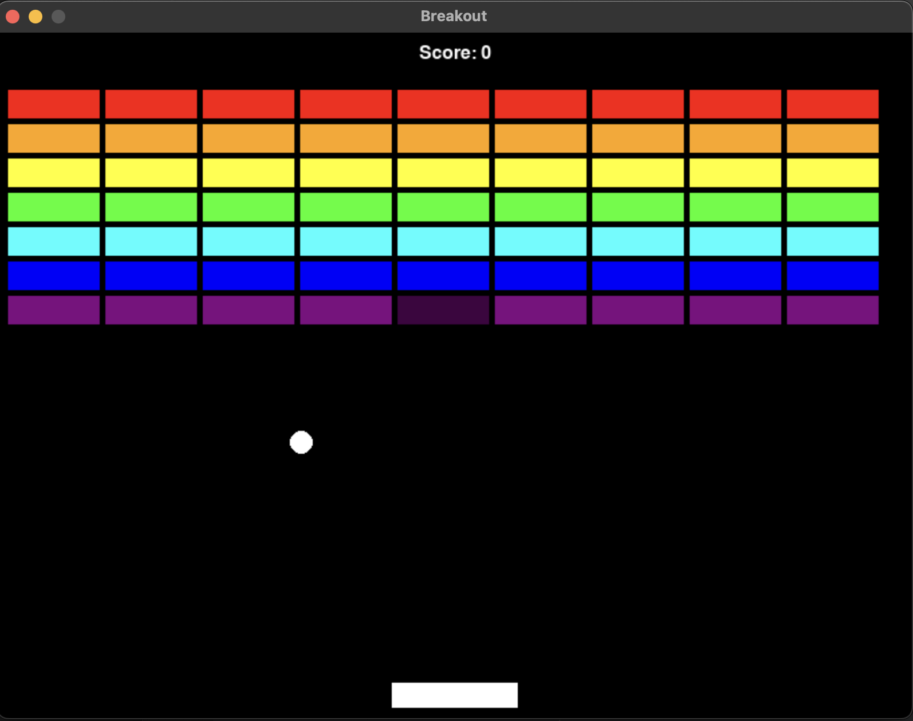

# 🏓 Pygame 打磚塊遊戲

一個使用 Pygame 開發的經典打磚塊 (Breakout) 遊戲，包含完整的遊戲機制和視覺效果。

## 📚 教學講義

> **🔗 [點擊查看完整教學講義](https://telearn.best/slides/projects/breakout/)**

本專案是根據上述教學講義逐步開發而成的，每個功能都是按照講義的指導一步步實現並提交到 Git 版本控制中。

## ✨ 遊戲特色



- 🎮 **經典玩法**：控制球拍接住球，打破所有磚塊
- 🌈 **彩色磚塊**：七種顏色的磚塊牆，每種顏色有不同分數
- 💥 **碰撞系統**：精確的球與球拍、磚塊碰撞偵測
- 🎯 **分數系統**：擊破不同顏色磚塊獲得對應分數
- 🎨 **視覺效果**：簡潔明瞭的遊戲介面和動畫
- 🏆 **遊戲狀態**：開始畫面、遊戲進行中、結束畫面

## 🚀 如何運行

### 環境需求

- Python 3.13.0 (推薦使用 pyenv 或 conda 管理版本)
- Pygame 2.0+

### 安裝依賴

```bash
pip install -r requirements.txt
```

或者手動安裝：

```bash
pip install pygame
```

### 運行遊戲

```bash
python breakout.py
```

## 🎯 遊戲玩法

1. **開始遊戲**：按任意鍵開始
2. **控制球拍**：使用 `←` `→` 方向鍵移動球拍
3. **接住球**：確保球不會掉到螢幕底部
4. **打破磚塊**：讓球擊中磚塊來打破它們
5. **獲勝條件**：打破所有磚塊即可獲勝
6. **重新開始**：遊戲結束後按任意鍵重新開始

## 🛠️ 技術實現

- **語言**：Python 3
- **遊戲引擎**：Pygame
- **架構**：物件導向設計
- **版本控制**：Git (15 次逐步提交)

### 核心類別

- `Paddle`：玩家控制的球拍
- `Ball`：遊戲中的球體
- `Brick`：可被打破的磚塊

[詳細了解 Pygame Sprite 系統](pygame_sprite_guide.md)

## 📈 開發歷程

本專案採用逐步開發的方式，每個主要功能都對應一次 Git 提交：

1. **Part 1**：基礎設定 (匯入函式庫、常數定義、遊戲主迴圈)
2. **Part 2**：核心物件 (Paddle、Ball 類別與 Sprite Group)
3. **Part 3**：互動與移動 (玩家輸入、碰撞偵測)
4. **Part 4-6**：磚塊系統、遊戲狀態管理與 UI

## 📝 授權

本專案遵循教學講義的指導開發，僅供學習和個人使用。

---

*使用 Pygame 創造經典遊戲體驗！* 🎉